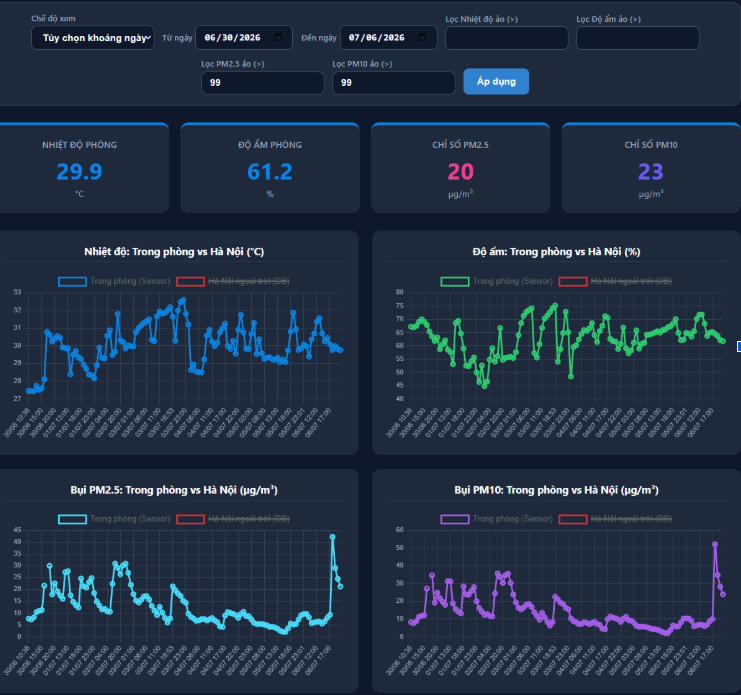
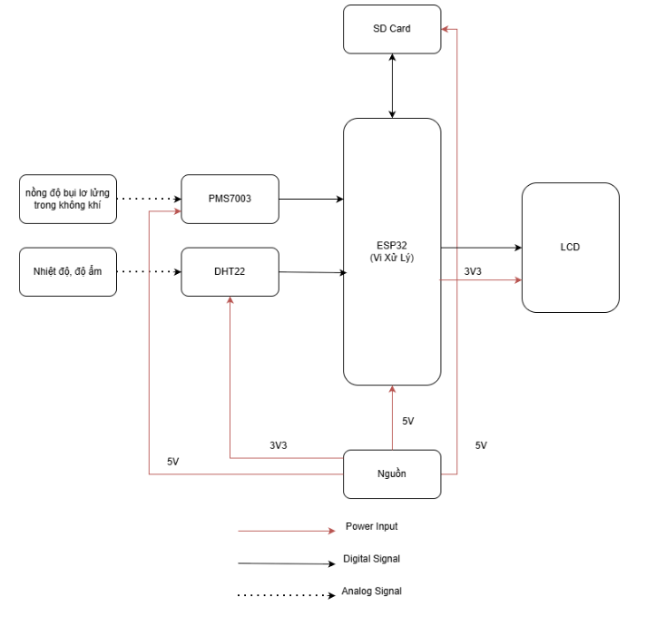
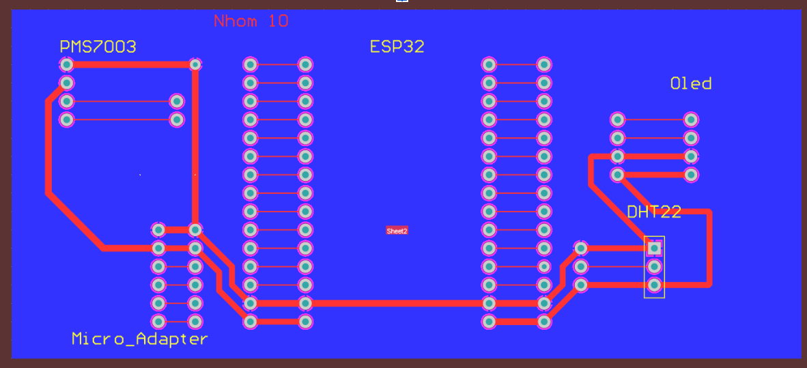
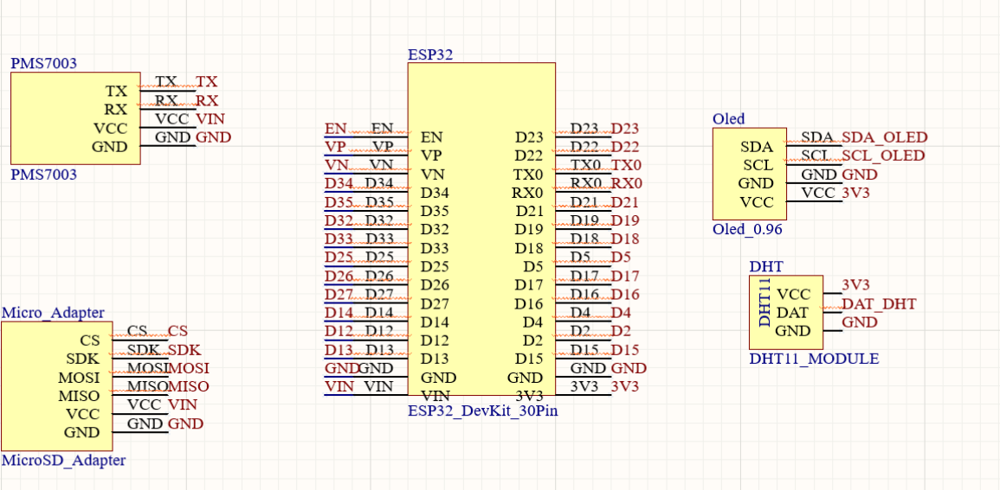

# ESP32 IoT Air Quality Monitor

Hệ thống giám sát chất lượng không khí thông minh dựa trên vi điều khiển ESP32, tích hợp đo lường bụi mịn (PM2.5, PM10), nhiệt độ, độ ẩm phòng, lưu trữ dữ liệu ngoại tuyến (offline datalogging) và trực quan hóa qua Web Dashboard thời gian thực.

---

## 📌 Tính năng chính

- **Đo lường thời gian thực:**
  - Nồng độ bụi mịn PM2.5 và PM10 qua cảm biến laser PMS7003.
  - Nhiệt độ và độ ẩm phòng thông qua cảm biến DHT22.
- **Hiển thị tại chỗ:** Màn hình OLED SSD1306 (I2C) cập nhật trạng thái hoạt động và các chỉ số đo liên tục.
- **Lưu trữ dữ liệu an toàn:** Ghi log thông số đo định kỳ dưới dạng file CSV vào thẻ nhớ MicroSD.
- **Web Dashboard trực quan:** 
  - Giao diện web hiển thị chỉ số tức thời và biểu đồ trực quan xu hướng biến thiên.
  - So sánh đối chiếu chỉ số môi trường trong phòng với dữ liệu thời tiết ngoài trời tại Hà Nội.
  - Bộ lọc hỗ trợ tùy chọn khoảng thời gian và lọc bỏ các giá trị dị biệt/nhiễu.
- **Cảnh báo từ xa:** Tích hợp cảnh báo vượt ngưỡng an toàn thông qua Webhook.

---

## 🖼️ Giao diện & Phần cứng

### Web Dashboard


### Sơ đồ khối & Mạch phần cứng
| Sơ đồ khối hệ thống | Thiết kế mạch in (PCB) | Mạch phần cứng thực tế |
| :---: | :---: | :---: |
|  |  |  |

---

## 🗂️ Cấu trúc thư mục

```text
ESP32-IoT-Air-Quality-Monitor/
├── README.md
├── firmware/
│   └── esp32.ino
├── docs/
│   └── Project_Report.docx
└── images/
    ├── web_dashboard.png
    ├── pcb.png
    └── schematic.png
